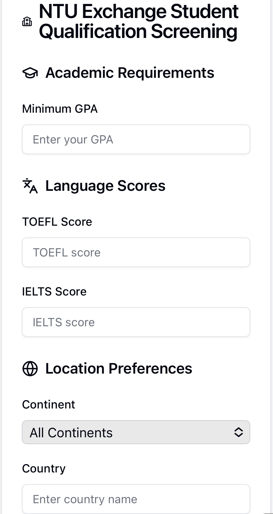

# Ntu-Exchange-Screening System
# __Abstract and Motivation__:
The exchange student system webpage of National Taiwan University is not intuitive and organizes information by school, requiring students to visit each school's webpage to find application details such as required language tests and minimum GPA limits.<br>
To address this issue, we aim to create a webpage where students can input their language certificates or test scores, GPA, and desired state or region. The system will then automatically filter and display schools and departments that match the student's qualifications, significantly reducing the time and effort spent researching and verifying application criteria.
# Topic: Screening exchange schools that meet application requirements
__Web crawler__: Crawls the information we need from the webpage of the National Taiwan University International Office List of Exchange Schools at National Taiwan University and organizes it.<br> <br>
__Webpage__: Create a window that allows users to input their language test scores, departments, GPA and other information, and then select the country they want to view. Finally, a organized form will pop up, showing the schools they can apply for and the school's detailed information.

# Web Crawler Algorithm:
Our goal is to have the program click on the "Application Information" page of each school sequentially from the list of applied schools, and then crawl out the information of individual schools.<br>
<br>
(pic1: List of exchange student programs at National Taiwan University)
<br>
(pic2: Application information pages for each university)<br>
 <br>
Therefore, first crawl out all the web links to the "Application Information" page that you want to enter sequentially from the list, and store them in the list of filtered_links.<br>
```python
# Get the source code of the web page
url = "https://oia.ntu.edu.tw/outgoing/school.list"  # 將URL替換為你的目標網頁
response = requests.get(url)
soup = BeautifulSoup(response.text, "html.parser")

# Find links to all application data requirements
links = soup.find_all('a', href=True, text='申請資料')

# Filter out links to specific websites
filtered_links = [link for link in links if '聖保羅大學' not in link.get('href')]
```
Next, we use __loops__ to crawl data on the pages of different schools. We save all the required data into the list first, so that it can be added to the csv at once.<br>
 <br>
__1. Chinese and English name of the university__<br>
During our testing, we found that there were English commas in the English names, which would affect the formatting of the csv file during output, so we replaced          them with "," and stored the Chinese and English names separately.<br>
__2. Second application__<br>
Similar to the above, the attribute used is 'class': 'uninfo-awall', and it is judged whether there is the keyword "This school is open to students who want to go abroad for exchange for the second time."<br>
__3. Other precautions__<br>
Since other items including "Application Qualifications", "Quota", "School Calendar", "Registration and Payment", "Notes", and "Accommodation Information" are all stored in the same "class":'uninfo-content' title, among which Most do not have a uniform format. Therefore, we first climb down and save it into the double list of uninfo_contents, and then do segmentation and sorting later. Use "、" to replace "," at the same time to avoid csv file jumping.
(The contents of each list in uninfo_contents are in the order described above. For example, the application qualification is item 0)<br>
 <br>
We use another loop to sort out "a bunch of notes" according to different universities, and save the sorted information into a list for final output to a csv file:<br>
```python
for i in range(len(uninfo_contents_list)):
```
__1. Open exchange quota__<br>
Use the fixed text format "X names in one semester" in "Quota" to find the positions of semesters and names respectively. Note that if the exchange is not open, such a format cannot be found, so append "0" directly to avoid the final format jumping.<br>

__2. GPA__<br>
Search for the keyword "GPA" in "Application Qualifications" to find out one or more GPA score requirements to two decimal places.<br>
```python
# GPA
    ct = 0
    score = ""
    while True:
        index = uninfo_contents_list[i][0].find("GPA", ct)
        if index == -1 and ct == 0:
            score = "None"
            break
        if index == -1:
            break
        else:
            score += uninfo_contents_list[i][0][index + 5:index + 9]
            ct = index + 1
    gpa_list.append(score)
```
__3. World ranking__<br>
Since the application information webpage does not have world rankings, we first used another program to crawl out the QS World University Rankings, saved them into a csv file, then used pandas to merge the files of National Taiwan University Exchange School and the world rankings, and then converted them into a dictionary. If the university does not have world ranking information, None will be displayed in this column.<br>
```python
QS_rank_dict = {'Université Laval': '416', ……  'The University of Auckland': '88', 'University of Cape Town': '198'}

 # World ranking
    if english_uni_list[i] in QS_rank_dict.keys():
        univ_rank_list.append(QS_rank_dict[english_uni_list[i]])
    else:
        univ_rank_list.append("None")
```
__4. Application group__<br>
The same method as GPA, find the position of all keyword "group" in the application qualifications, take the first two words into the group (for example: Japanese group) and add it to the empty string, and collect it every time you complete a university Add the obtained string to language_group_list and clear the string. If there is no group, append "None".<br>

__5. College Restrictions__<br>
Pre-store all the colleges of National Taiwan University as keywords in the list:<br>
```python
academy_key_list = ["電機資訊學院", "管理學院", "法律學院", "醫學院", "公共衛生學院", "工學院", "理學院", "社會科學院", "文學院", "生命科學院", "生物資源暨農學院"]
```
Then use in in the application qualification field to check whether the keyword is included one by one. If so, add this keyword to the mid_academy_restrict_list relay list. After each college is visited, the relay list is put into the double-layered list of academy_restrict_list.
However, since this method only finds out whether it contains keywords, and among the college restrictions, __some are "restricted to ○○ colleges for application" and some are "○○ colleges are not allowed to apply",__ so the output results must be manually adjusted afterwards.<br>
```python
# College Restrictions
    mid_academy_restrict_list = []
    for keyword in academy_key_list:
        if keyword in uninfo_contents_list[i][0]:
            mid_academy_restrict_list.append(keyword)
    if mid_academy_restrict_list == []:
        mid_academy_restrict_list.append("None")
    academy_restrict_list.append(mid_academy_restrict_list)
```
__6. Language certificate__<br>
Similar to the above method, manually check any several universities in each region, find all the test names and put them into the keyword list:<br>
```python
certificate_key_list = ["葡萄牙語能力證明", "TOEFL iBT", "IELTS", "法語檢定", "全民英檢", "西語檢定", "DELE", "SIELE", "日文檢定", "韓語檢定", "俄語檢定", "德語檢定"]
```
Check the application qualifications one by one to see if they contain specific tests and put them in the relay list. __The difference from the above is that since the formats of IELTS and TOEFL scores are relatively consistent, scores can be added uniformly through the program,__ while other tests do not have a unified format, so other tests need to be manually adjusted afterwards to add score requirements.<br>
 <br>                                                                                                                                                                     
The last step of the crawler is to store all the collated data into a csv file:<br>
What is more special is that the language certificates and college restrictions are stored in a double-layered list. They are exported into a single-column csv file using a double-layered loop. If there are more than two values ​​in each university that need to be exported, use Chinese commas to separate them. (English commas will be judged as column changes in csv).<br>
```python
for i in range(0, len(uninfo_contents_list)):
    for k in range(0, len(certificate_need_list[i]) - 1):
        file2.write(str(certificate_need_list[i][k]) + "，")
    file2.write(str(certificate_need_list[i][-1]) + "\n")
```
__Part of the data exported after manual sorting:__<br>
<br>
 <br>
# __System Interface Algorithm__:<br>
The following is a screenshot of the system screen. The upper half is the condition menu that is initially executed. After everyone has entered all the search conditions and clicks Submit, the results window in the lower half will pop up, listing the schools that meet the conditions and related information.<br>
<br>
__(1) Input interface__

Our interface is mainly divided into left half and right half.<br>

[left half]<br>
List common language tests in various countries, including IELTS and TOEFL
It is a field that requires input of numbers, so a number input field is set.<br>

Since there are only 5 to 6 options for the remaining tests, a drop-down menu is provided for the user to input.<br>
 <br>
[right half]<br>
List other conditions that need to be filtered, including the user's personal GPA in the previous academic year and the department or department where he or she is located.<br>
<br>
 <br>
Finally, enter the country you want to view and let the system sort out the schools he can apply for.<br>
<br>
__(2) Output interface__

The following information is output from this form:<br>
1. School Chinese name<br>
2. School English name<br>
3. Country<br>
4. World ranking information<br>
5. Application group: Some schools offer more than one group to apply for. There may be a general group and a specific language group, so they are listed here for your reference.<br>
6. Specific GPA lower limit: You can confirm the required GPA and evaluate whether your own GPA is much higher than the lower limit.<br>
7. Department restrictions: Although it has been filtered through the program code, some schools in this column have language test score restrictions for specific departments, so we chose to present them.<br>
8. Language test: Although it has been screened through the program code, this column contains more detailed instructions, for example: the minimum requirements for TOEFL writing, whether to accept home edition; the minimum standards for each IELTS subject, etc.<br>

__(3) Special function libraries used__

1. tkinter - Create menu screen, including drop-down and input fields<br>
2. csv - read crawler data<br>
3. pandas - Create result output screen<br>

__(4) Judgment and screening process__

We use four major steps to select schools that meet the criteria, put the school numbers that pass the screening at each level into a list, and finally take the intersection and present it.<br>
 <br>
First, match the information of the department to "XX department only" or "XX department not accepted" to get the school number to which the department can apply.<br>
Secondly, remove the schools with 0 exchange places for this semester and only take out the schools with exchange places.<br>
Furthermore, refer to the input language test scores and confirm whether the information specified by the corresponding school is met, and obtain the qualified school number.<br>
Finally, consider the selected country and limit the intersection to schools in that country.

# Remark: Produce by Claude

I entered my information and methods into claude, and he generated a beautiful web page.

<br>

```python
import React, { useState } from 'react';
import { Card, CardHeader, CardTitle, CardContent } from '@/components/ui/card';
import { Input } from '@/components/ui/input';
import { Button } from '@/components/ui/button';
import { Select } from '@/components/ui/select';
import { Label } from '@/components/ui/label';
import { Checkbox } from '@/components/ui/checkbox';
import { Globe, School, Languages, GraduationCap } from 'lucide-react';

// Sample data - in real application, this would come from an API
const sampleUniversities = [
  {
    name: "University of Tokyo",
    country: "Japan",
    continent: "Asia",
    worldRank: 23,
    gpaRequirement: 3.0,
    languageRequirement: {
      TOEFL: 80,
      IELTS: 6.5,
      JLPT: "N2"
    },
    quota: 5,
    website: "https://www.u-tokyo.ac.jp/en/",
    applicationUrl: "https://www.u-tokyo.ac.jp/en/prospective-students/",
    tuitionFees: "Waived",
    departments: ["Engineering", "Science", "Business"]
  },
  {
    name: "University of California, Berkeley",
    country: "USA",
    continent: "North America",
    worldRank: 4,
    gpaRequirement: 3.5,
    languageRequirement: {
      TOEFL: 90,
      IELTS: 7.0
    },
    quota: 3,
    website: "https://www.berkeley.edu/",
    applicationUrl: "https://admissions.berkeley.edu/",
    tuitionFees: "Required",
    departments: ["All"]
  }
];

const ExchangeScreening = () => {
  const [filters, setFilters] = useState({
    gpa: "",
    toefl: "",
    ielts: "",
    continent: "",
    country: "",
    department: ""
  });
  
  const [filteredResults, setFilteredResults] = useState([]);
  const [isFiltered, setIsFiltered] = useState(false);

  const handleFilter = () => {
    const results = sampleUniversities.filter(uni => {
      const gpaCheck = !filters.gpa || uni.gpaRequirement <= parseFloat(filters.gpa);
      const toeflCheck = !filters.toefl || 
        (uni.languageRequirement.TOEFL && uni.languageRequirement.TOEFL <= parseInt(filters.toefl));
      const ieltsCheck = !filters.ielts || 
        (uni.languageRequirement.IELTS && uni.languageRequirement.IELTS <= parseFloat(filters.ielts));
      const continentCheck = !filters.continent || uni.continent === filters.continent;
      const countryCheck = !filters.country || uni.country.toLowerCase().includes(filters.country.toLowerCase());
      const departmentCheck = !filters.department || 
        uni.departments.includes("All") || 
        uni.departments.includes(filters.department);

      return gpaCheck && toeflCheck && ieltsCheck && continentCheck && countryCheck && departmentCheck;
    });

    setFilteredResults(results);
    setIsFiltered(true);
  };

  return (
    <div className="min-h-screen bg-gray-50 p-8">
      <Card className="max-w-6xl mx-auto">
        <CardHeader>
          <CardTitle className="text-2xl font-bold flex items-center gap-2">
            <School className="h-6 w-6" />
            NTU Exchange Student Qualification Screening
          </CardTitle>
        </CardHeader>
        <CardContent>
          <div className="grid grid-cols-1 md:grid-cols-2 lg:grid-cols-3 gap-6 mb-8">
            {/* Academic Requirements */}
            <div className="space-y-4">
              <h3 className="text-lg font-semibold flex items-center gap-2">
                <GraduationCap className="h-5 w-5" />
                Academic Requirements
              </h3>
              <div className="space-y-2">
                <Label htmlFor="gpa">Minimum GPA</Label>
                <Input
                  id="gpa"
                  type="number"
                  step="0.01"
                  placeholder="Enter your GPA"
                  value={filters.gpa}
                  onChange={(e) => setFilters({...filters, gpa: e.target.value})}
                  className="w-full"
                />
              </div>
            </div>

            {/* Language Requirements */}
            <div className="space-y-4">
              <h3 className="text-lg font-semibold flex items-center gap-2">
                <Languages className="h-5 w-5" />
                Language Scores
              </h3>
              <div className="space-y-2">
                <Label htmlFor="toefl">TOEFL Score</Label>
                <Input
                  id="toefl"
                  type="number"
                  placeholder="TOEFL score"
                  value={filters.toefl}
                  onChange={(e) => setFilters({...filters, toefl: e.target.value})}
                  className="w-full"
                />
              </div>
              <div className="space-y-2">
                <Label htmlFor="ielts">IELTS Score</Label>
                <Input
                  id="ielts"
                  type="number"
                  step="0.5"
                  placeholder="IELTS score"
                  value={filters.ielts}
                  onChange={(e) => setFilters({...filters, ielts: e.target.value})}
                  className="w-full"
                />
              </div>
            </div>

            {/* Location Preferences */}
            <div className="space-y-4">
              <h3 className="text-lg font-semibold flex items-center gap-2">
                <Globe className="h-5 w-5" />
                Location Preferences
              </h3>
              <div className="space-y-2">
                <Label htmlFor="continent">Continent</Label>
                <select
                  id="continent"
                  className="w-full rounded-md border border-gray-300 p-2"
                  value={filters.continent}
                  onChange={(e) => setFilters({...filters, continent: e.target.value})}
                >
                  <option value="">All Continents</option>
                  <option value="Asia">Asia</option>
                  <option value="Europe">Europe</option>
                  <option value="North America">North America</option>
                  <option value="South America">South America</option>
                  <option value="Oceania">Oceania</option>
                  <option value="Africa">Africa</option>
                </select>
              </div>
              <div className="space-y-2">
                <Label htmlFor="country">Country</Label>
                <Input
                  id="country"
                  placeholder="Enter country name"
                  value={filters.country}
                  onChange={(e) => setFilters({...filters, country: e.target.value})}
                  className="w-full"
                />
              </div>
            </div>
          </div>

          <Button 
            onClick={handleFilter}
            className="w-full md:w-auto"
          >
            Search Universities
          </Button>

          {/* Results Section */}
          {isFiltered && (
            <div className="mt-8">
              <h3 className="text-xl font-semibold mb-4">Search Results ({filteredResults.length} universities found)</h3>
              <div className="grid grid-cols-1 gap-4">
                {filteredResults.map((uni, index) => (
                  <Card key={index} className="p-4">
                    <div className="flex justify-between items-start">
                      <div>
                        <h4 className="text-lg font-semibold">{uni.name}</h4>
                        <p className="text-sm text-gray-600">{uni.country} • World Rank: {uni.worldRank}</p>
                      </div>
                      <div className="text-right">
                        <p className="text-sm font-semibold">Available Spots: {uni.quota}</p>
                        <p className="text-sm text-gray-600">Tuition: {uni.tuitionFees}</p>
                      </div>
                    </div>
                    <div className="mt-4 grid grid-cols-2 gap-4 text-sm">
                      <div>
                        <p className="font-semibold">Language Requirements:</p>
                        <ul className="list-disc list-inside">
                          {uni.languageRequirement.TOEFL && (
                            <li>TOEFL: {uni.languageRequirement.TOEFL}</li>
                          )}
                          {uni.languageRequirement.IELTS && (
                            <li>IELTS: {uni.languageRequirement.IELTS}</li>
                          )}
                          {uni.languageRequirement.JLPT && (
                            <li>JLPT: {uni.languageRequirement.JLPT}</li>
                          )}
                        </ul>
                      </div>
                      <div>
                        <p className="font-semibold">Available Departments:</p>
                        <p>{uni.departments.join(", ")}</p>
                      </div>
                    </div>
                    <div className="mt-4 flex gap-4">
                      <a
                        href={uni.website}
                        target="_blank"
                        rel="noopener noreferrer"
                        className="text-blue-600 hover:underline text-sm"
                      >
                        Official Website
                      </a>
                      <a
                        href={uni.applicationUrl}
                        target="_blank"
                        rel="noopener noreferrer"
                        className="text-blue-600 hover:underline text-sm"
                      >
                        Apply Now
                      </a>
                    </div>
                  </Card>
                ))}
              </div>
            </div>
          )}
        </CardContent>
      </Card>
    </div>
  );
};

export default ExchangeScreening;
```
